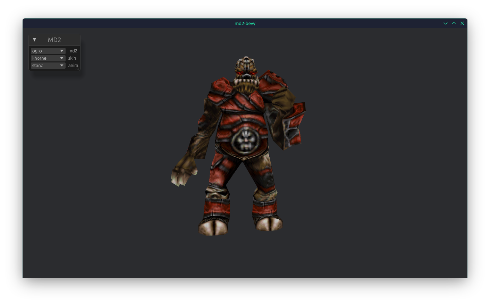
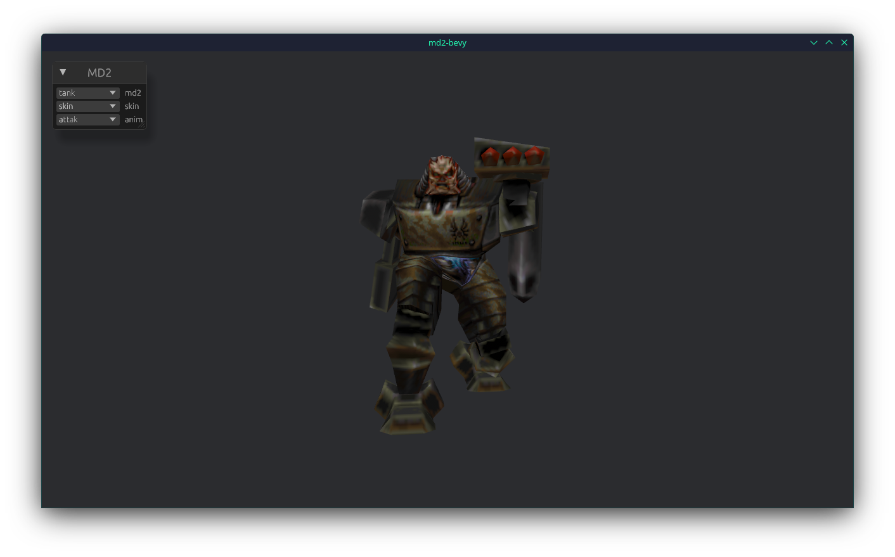

# md2-bevy
**This is a personal project used for learning. Pull requests will mostly be ignored.**

An MD2 model renderer writing with the [Bevy Engine](https://bevy.org/). The goals of this project
are to re-create my md2view project in Rust in order to improve my Rust skills while also learning
one of the most popular Rust game engine frameworks.

## Features

This can load .md2 models and render them with skins and key frame animations. Currently it only supports
loading models directly from .md2 files and skins from .png files. There is a simple UI which lets you select
the current model, skin, and animation.

There are simple WASD style camera controls and you can use the mouse to control pitch and yaw either by hitting
the M key or holding down the left mouse button.

NOTE: The models are intentionally not included, if you own Quake 2 you can extract them from the PAK files and
convert the textures to png format.

## TODO

- .pcx image asset loading
- .pak file loading
- glow shader
- spawning multiple models
- model picking
